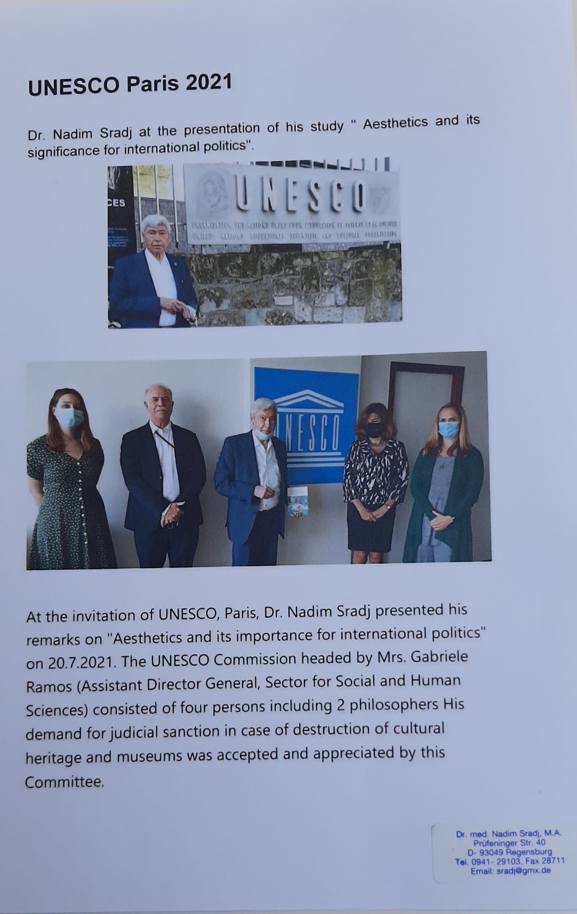

<style>
.title{
  display: none;
}
</style>

```{css, echo=FALSE}
body {
  font-family: Arial, sans-serif;
  line-height: 1.6;
  color: #333;
}

.center {
  display: flex;
  justify-content: center;
  align-items: center;
  flex-direction: column;
}

.center img {
  max-width: 100%;
  border-radius: 10px;
  box-shadow: 0 4px 6px rgba(0, 0, 0, 0.1);
  margin: 10px 0;
}

h1 {
  font-size: 2.5em;
  margin-bottom: 10px;
}

p {
  font-size: 1.1em;
  text-align: justify;
  margin-bottom: 20px;
}

a {
  color: #1a73e8;
  text-decoration: none;
}

a:hover {
  text-decoration: underline;
}
```

<div class="center">
  
</div>

<div class="center">
  
</div>

<div class="center">
  
</div>

<div class="center">
  
</div>

<div class="center">
  
</div>

<div class="center">
  
</div>

<div class="center">
  
</div>

<div class="center">
  
</div>

<div class="center">
  
</div>

<div class="center">
  
</div>

<div class="center">
  
</div>

<div class="center">
  
</div>

<div class="center">
  
</div>

```{r setup, include=FALSE}
  knitr::opts_chunk$set(echo = TRUE)
  options(knitr.duplicate.label = "allow")
```

